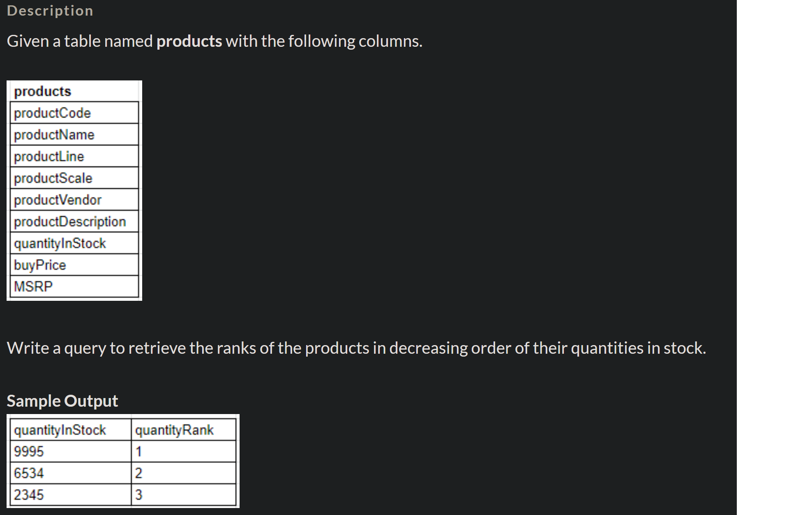

Below are all the concepts with queries I learnt during my "Advanced SQL: Learn SQL Functions and Formulas" from upGrad.

Certificate link: 

# Window Functions

## The Rank Function 
The following snippet orders the sales by rank:

```
select ord_id, round(sales) as rounded sales, customer name, rank() over (order by sales desc) as sale_amount_rank
from market_fact_full
inner join cust_dimen
using (cust_id)
where customer_name like 'Aron Smayling';
```

The following snippet 
1) renames the above query's result to Rank_Info and 
2) gets us top-n results by treating it as a separate table column:
```
with Rank_Info as(
    select ord_id, round(sales) as rounded sales, customer name, rank() over (order by sales desc) as sale_amount_rank
    from market_fact_full
    inner join cust_dimen
    using (cust_id)
    where customer_name like 'Aron Smayling';
)
select ord  select ord_id, round(sales) as rounded sales, customer name, sale_amount_rank
from Rank_Info
where sale_amount_rank<=10;
```
question-

```
use upgrad;
select quantityInStock, rank() over ( order by quantityInStock desc) as quantityRank from products;
```

## Rank vs Dense Rank
The following snippet displays the difference in rank() and dense_rank() functions:
```
select ord_id, round(sales) as rounded sales, customer name, rank() over (order by discount desc) as discount_rank, dense_rank over (order by discount desc) as discount_dense_rank
from market_fact_full
inner join cust_dimen
using (cust_id)
where customer_name like 'Aron Smayling';
```

## Rank on Aggregate operations
The following snippet displays customers in the decreasing order of the number of orders placed and their ranks:
```
select customer_name, count(ord_id) as ord_id,
rank() over (order by count(ord_id) desc ) as order_count_rank
from cust_dimen
inner join market_fact_full
using (cust_id)
group by customer_name;
```