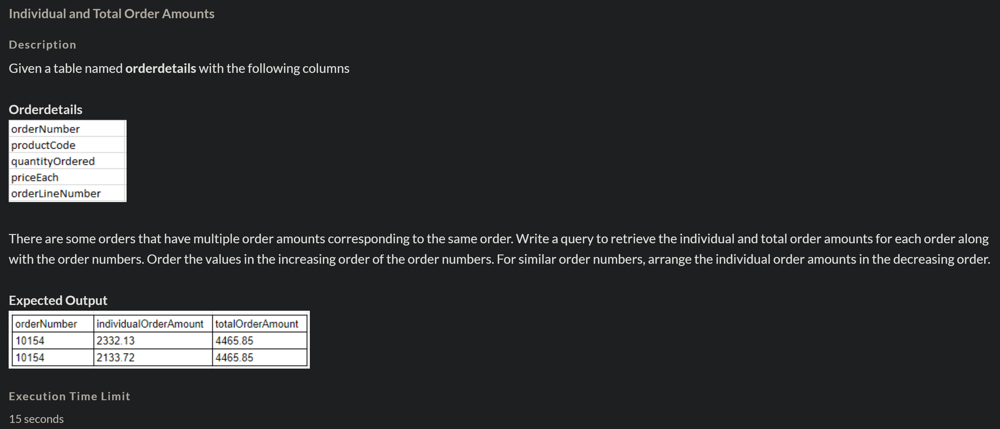
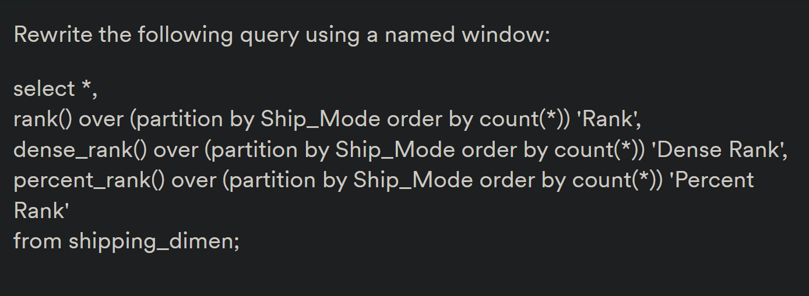
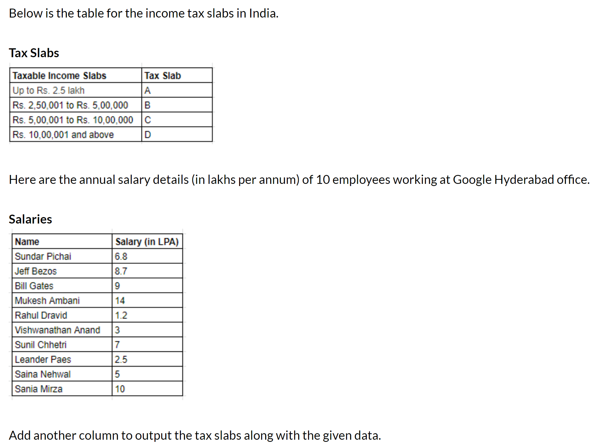
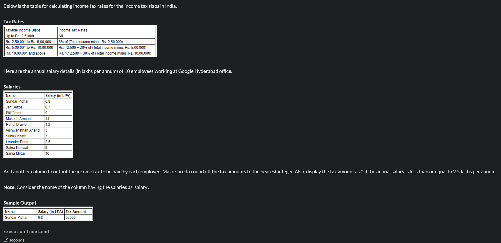

# Question 1


```
use upgrad;
select quantityInStock, rank() over ( order by quantityInStock desc) as quantityRank from products;
```

# Question 2


```
use upgrad;
with temp_table as(
select orderNumber, (priceEach*quantityOrdered) as indiviualOrderAmount
from Orderdetails
order by orderNumber, indiviualOrderAmount desc
)
select *,
sum(indiviualOrderAmount) over (partition by orderNumber order by orderNumber)
from temp_table;
```

# Question 3


```
select *,
rank() over w as Rank,
dense_rank() over w as Dense Rank,
percent_rank() over w as Percent Rank
from shipping_dimen
window w as (partition by Ship_Mode order by count(*));
```

# Question 4


```
use upgrad;
select name,salary,
case
    when salary <=2.5 then 'A'
    when salary> 2.5 and salary<=5 then 'B'
    when salary> 5 and salary <=10 then 'C'
    else 'D'
end as 'Tax Slab'
from Salaries;
```

# Question 5


```
use upgrad;

# Write your code below
select *,
(case 
    when salary<=2.5 then 0
    when salary>2.5 and salary<=5 then round((5/100)*(((salary*100000)-250000)))
    when salary>5 and salary<=10 then round(12500+(20/100*(((salary*100000)-500000))))
    else round(112500 +((30/100)*(((salary*100000)-1000000))))
end)as `Tax Amount`
from salaries;
```

